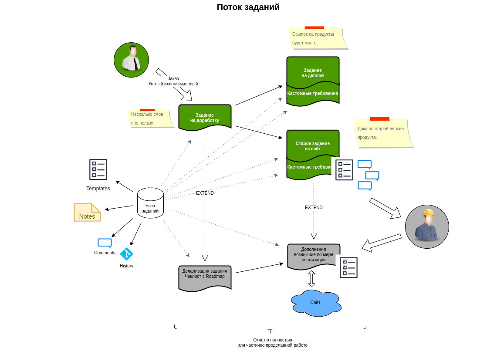

# Фреймворк

Фреймворк с помощью которого вы сможете быстро составлять задания на разработку продуктов или оказание услуг.
Подходит для самостоятельного использования или внутри команды, с внутренним или внешним заказчиком.

Фреймворк даёт инструменты для учёта заданий, но нарочно избегает учёта заказов. Если вам такой вид учёта нужен, то используйте
фреймворк совместно с дополнительным специализированным таск-трекером или подобной системой. [Чем заказы отличаются от заданий](./assignment_vs_task.md).

## Сущности фреймворка

- [Задание на продукт](./product/)
    - [Job Story](/framework/job_story.md)

### Задание на продукт

Задание на продукт — это описание, выполненное по стандартному шаблону. Совмещает в себе ТЗ с отчётом о проделанной работе.

TODO. Показать отличия задания и ТЗ.

### Job Story

TODO. Сравнить с user stories и use cases.

## Рекомендации по составлению заданий

TODO. О чём важно упомянуть:

- Единственный обязательный раздел это "profit", остальное можно заполнить по ходу дела. Без "пользы" любое задание на продукт теряет смысл.
- Составление yaml-задание — это мозгоёмкая задача, и лучше её выполнять в итерациями во много заходов
- Оставляйте комментарии в yaml-задании `# TODO` и `# FIXME`
- Чеклист собран в [отдельном документе](/framework/product/assignment.yaml)

TODO. Рассказать о нормальной последовательности заполнения задания:

```
Польза → … → Границы продукта → Риски → Job stories
                                       ↳  Как проверить
                                       ↳  Шаблон отчёта о поддержке проекта
```

## Поток заданий

TODO. Описать процесс работы с заданием от "поступил заказ" до "работа сдана заказчику".




## Читать далее

- [Задание на фреймворк](./assignment.yaml)
