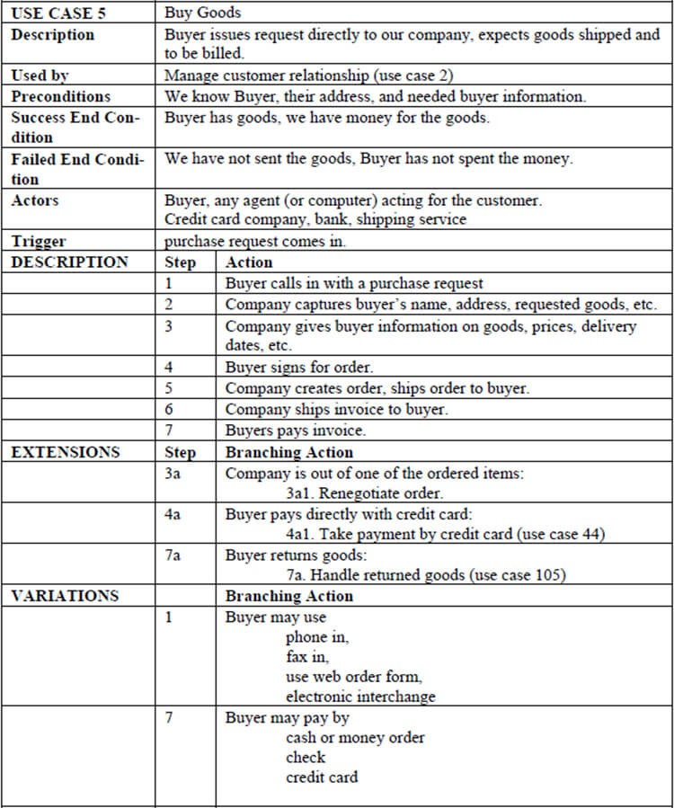

# Сравнение со сценарием использования «use case»

Сценарии использования или use case — это описание взаимодействия пользователя с системой в виде текста или блок-схемы с ветвлениями. Обычно каждый use-case оформляется на отдельном бланке A4.

Интерфейс сайта по природе своей асинхронен и нелинеен. Даже чат-боты несмотря на свою нелинейность всегда позволяют вернуться на предыдущий шаг или в главное меню, чтобы начать с начала. Действия пользователя имеет смысл рассматривать как итеративный нелинейный процесс.

> На самом деле большую часть реального полного Use Case составляет не основной поток, а альтернативные потоки, которые позволяют задавать ветвления потока, циклы и обрабатывать «неправильные» события.

Линейность приходит позже, когда сценарии использования покрываем тестами. Поэтому приёмочных тестов получается так много на каждый сценарий использования. Ну и поддерживать тесты в актуальном состоянии тяжело.

Общая проблема здесь в конецепции "бизнес-процесса". Мы описываем работу системы человек-машина как детерминированный последовательный процесс. Но на деле всё, что легко свести к линейному процессу так же легко поддаётся полной автоматизации. Люди остаются лишь в тех бизнес-процессах, где важна нелинейность. Поэтому описывать взаимодействие человека с машиной как линейный процесс нельзя. Взаимодействие вариативно, изменчиво, зависит от состояния системы, желания разных людей и их возможностей.

Сценарии использования становятся полезны, когда в системе есть много pipelines -- этапов обработки заявок/заказов/etc. Вот такие pipelines как раз удобно фиксировать в виде линейного сценария. Внутри каждого отдельного этапа сокрыта нелинейность, а переходы из одного стейта в следующий, напротив, линейны.

Подробнее про [Сценарии использования](/products/dvmn_org/use-case/).